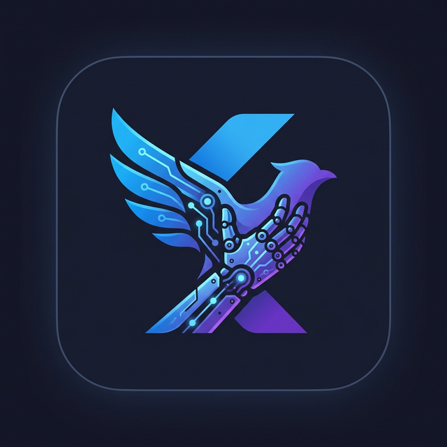

<p align="center">
  
</p>

<h1 align="center">ai_flutter_agent</h1>

<p align="center">
  <strong>Let LLMs operate Flutter app UIs through the Semantics tree.</strong><br>
  Perceive → Plan → Execute → Verify — a complete agent loop with built-in safety.
</p>

<p align="center">
  <a href="https://github.com/ImL1s/ai_flutter_agent/actions"></a>
  <a href="LICENSE"></a>
  <a href="https://flutter.dev"></a>
  <a href="https://dart.dev"></a>
</p>

---

## What is ai_flutter_agent?

`ai_flutter_agent` is a Dart/Flutter package that bridges **Large Language Models** and **Flutter UIs**. It captures the live Semantics tree, sends it to an LLM, executes the returned tool-call actions, and verifies the UI changed — all in an automated loop.

**Use cases:**
- 🤖 AI-powered UI testing — let an LLM explore and test your app
- ♿ Accessibility automation — leverage the Semantics tree for smart interactions
- 🔄 Macro recording & replay — capture user flows and re-execute them
- 🧪 E2E testing without brittle selectors — the LLM understands your UI

## Installation

Add to your `pubspec.yaml`:

```yaml
dependencies:
  ai_flutter_agent:
    git:
      url: https://github.com/ImL1s/ai_flutter_agent.git
```

Then run:
```bash
flutter pub get
```

## Architecture

```
┌─────────────────────────────────────────────────┐
│                   AgentCore                      │
│                                                  │
│  1. Perceive   SemanticTreeWalker.capture()       │
│       ↓        → WidgetDescriptor tree           │
│  2. Plan       Planner.plan()                    │
│       ↓        → LLMClient.requestActions()      │
│  3. Execute    Executor.executeAll()              │
│       ↓        → ActionRegistry (whitelist)       │
│  4. Verify     Verifier.verify()                  │
│       ↓        → VerificationDetail (diff)        │
│  (unchanged? retry up to maxRetries, then error)  │
└─────────────────────────────────────────────────┘
```

## Quick Start

```dart
import 'package:ai_flutter_agent/ai_flutter_agent.dart';

// 1. Wrap your app to enable Semantics
runApp(
  AgentOverlayWidget(
    enabled: true,
    child: MyApp(),
  ),
);

// 2. Register actions
final registry = ActionRegistry();
BuiltInActions.registerDefaults(registry);

// 3. Set up LLM client (OpenAI-compatible)
final llm = OpenAILLMClient(
  apiKey: 'your-api-key',  // or use env var
  model: 'gpt-4o',
  // baseUrl: 'http://localhost:1234/v1', // for local models
);

// 4. Build components
final auditLog = AuditLog();
final planner = Planner(llmClient: llm, actionRegistry: registry);
final executor = Executor(actionRegistry: registry, auditLog: auditLog);
final verifier = Verifier(treeWalker: SemanticTreeWalker());

// 5. Create and run agent
final agent = AgentCore(
  config: AgentConfig(maxSteps: 10),
  treeWalker: SemanticTreeWalker(),
  planner: planner,
  executor: executor,
  verifier: verifier,
);

await agent.run('Fill in the login form and tap Submit');

// Check results
print(agent.state.status);       // AgentStatus.completed
print(auditLog.entries.length);  // number of actions executed
```

## Key Features

| Category | Feature | Class | Description |
|:---------|:--------|:------|:------------|
| **Core** | UI Perception | `SemanticTreeWalker` | Captures live semantics tree as `WidgetDescriptor` |
| | Node Resolution | `NodeResolver` + `Selector` | Find nodes by id, label, role, or key |
| | Action Registry | `ActionRegistry` | Whitelist of allowed actions with OpenAI tool schemas |
| | Built-in Actions | `BuiltInActions` | tap, longPress, scroll, setText, focus, dismiss |
| **LLM** | OpenAI Client | `OpenAILLMClient` | HTTP-based, supports any OpenAI-compatible endpoint |
| | Streaming | `StreamingLLMClient` | Stream-based LLM responses |
| | Isolate Execution | `IsolateLLMClient` | Run LLM calls off the main thread |
| | Conversation History | `ConversationHistory` | Multi-turn context with FIFO eviction |
| | Retry | `RetryExecutor` | Exponential backoff for resilient LLM calls |
| **Safety** | Privacy Masking | `SensitiveDataMasker` | Strip emails, phones, credit cards before LLM |
| | Consent Gate | `ConsentHandler` | User approval before executing actions |
| | Action Timeout | `Executor` | Per-action timeout enforcement |
| | Action Confirmation | `Executor` | Per-action confirmation callbacks |
| | Audit Log | `AuditLog` | Every action recorded (success + failure) |
| **DX** | Prompt Templates | `PromptTemplate` | Customizable prompt formatting |
| | Verification Diff | `VerificationDetail` | Structured tree diff for change detection |
| | Macro Recording | `MacroRecorder` | Record & replay action sequences with serialization |
| | Debug Events | `DebugLogStream` | Stream events for debug overlay |
| | Lifecycle Hooks | `AgentCallbacks` | onStepStart, onActionExecuted, onComplete, onError |
| | Widget Wrapper | `AgentOverlayWidget` | Manages semantics lifecycle automatically |

## Advanced Usage

### Custom Prompt Template

```dart
final planner = Planner(
  llmClient: llm,
  actionRegistry: registry,
  promptTemplate: CustomPromptTemplate(
    template: 'UI:\n{ui}\n\nTask: {task}\n\nTools: {actions}',
  ),
);
```

### Privacy-Aware Agent

```dart
final agent = AgentCore(
  config: AgentConfig(maxSteps: 10),
  treeWalker: SemanticTreeWalker(),
  planner: planner,
  executor: executor,
  verifier: verifier,
  sensitiveDataMasker: SensitiveDataMasker(), // strips PII automatically
  consentHandler: ConsentHandler(
    onConsentRequired: (actions) async => true, // your approval logic
  ),
);
```

### Macro Recording

```dart
final recorder = MacroRecorder();
recorder.record(const ActionDescriptor(actionName: 'tap', args: {'id': '1'}));
recorder.record(const ActionDescriptor(actionName: 'setText', args: {'id': '2', 'text': 'hello'}));
final macro = recorder.toMacro('Login Flow');

// Serialize to JSON for storage
final jsonString = MacroStore.serialize(macro);

// Restore later
final restored = MacroStore.deserialize(jsonString);
```

### Local LLM Support

```dart
final llm = OpenAILLMClient(
  apiKey: 'not-needed',
  model: 'your-local-model',
  baseUrl: 'http://localhost:1234/v1', // LM Studio, Ollama, etc.
);
```

## Requirements

- **Flutter** ≥ 3.22.0
- **Dart** ≥ 3.4.0
- Your app widgets must have `Semantics` annotations for the agent to perceive them

## Testing

```bash
flutter test           # 181 tests
flutter analyze        # Static analysis
```

## License

[BSD 3-Clause](LICENSE)
